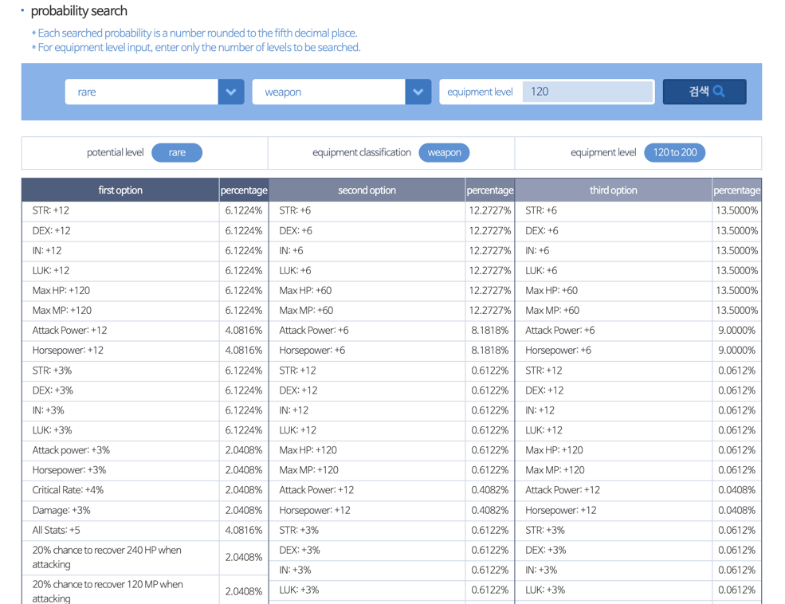

# KMS Cubing Data Scraper
Tool for scraping KMS website for cubing probability data.
Outputs formatted data to a json file for use by probability calculation scripts.

### Installing dependencies
To install dependencies, run:
```
pip install -r requirements.txt --user
```
Note: remember to omit the `--user` flag if running from a virtual environment.

### Running the scraper
To run with the default configuration:
```
./cubing_data_scrapyer.py
```
The output file with the formatted data is located at: `data/formatted_data.json`

> Notes:
>
> 1. This default configuration will issue requests for items types, cubes, and tiers that are currently supported by the calculator.
At the time of writing, this will make 140 requests and save each into a separate html file so it can take several minutes.
>
> 2. For now we are just manually copying and pasting the contents from `formatted_data.json` into the file: `cubingRates.js` but we should come up with a better solution.

### Current steps for updating cubing rates
1. Run the script and dump results (ideally into a separate data folder by date)
```
./cubing_data_scrapyer.py -o data_<DD-MM-YY>
```
2. Check for any un-translated lines in output debug messages. If we need to make changes to processing scripts, re-run on cached html files with `-c`:
```
./cubing_data_scrapyer.py -c -o data_<DD-MM-YY>
```
3. Set the value of `cubeRates` in `cubingRates.js` to the contents from `cubing_data_scraper/data_<DD-MM-YY>/formatted_data.json`. Paste the contents immediately following `const cubeRates =`

---

### Background info for context
The KMS cubing data page is here: https://maplestory.nexon.com/Guide/OtherProbability/cube/red

You can switch to a different cube type from the sidebar on the right.
To view the rates for a specific equipment configuration, select options from the "probability search" form and submit (see screenshot below):



The scraper basically automates the process of going through all the selection options we care about and saves the data form the tables to be used in our calculations.

---
### Running with custom options

See usage by running `./cubing_data_scrapyer.py -h`
```
usage: cubing_data_scraper.py [-h] [-c] [-o dir]

Scrape cubing probability data from KMS website.
    Outputs formatted data to a json file to be used by probability calculation scripts.
    Downloaded html files will be saved in a sub-folder called html_files

optional arguments:
  -h, --help            show this help message and exit
  -c, --use-cached      Use cached html files instead of downloading new ones. Default search location (parent directory is set by -o):
                        {dir}/html_files/
  -o dir, --output dir  {dir}/data
```

